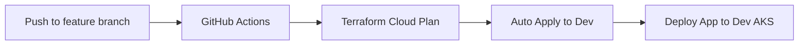
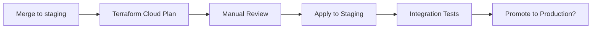
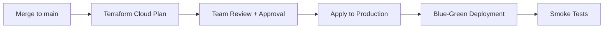

# Terraform Cloud Integration Guide

## Why Terraform Cloud > Repository Secrets?

### 🔒 **Security Benefits**
- **Centralized Secret Management**: All Azure credentials managed in Terraform Cloud
- **Reduced Attack Surface**: No secrets stored in GitHub repository settings
- **Audit Trail**: Complete deployment history and approval workflows
- **Environment Isolation**: Separate workspaces for dev/staging/prod

### 🚀 **Operational Benefits**
- **State Management**: Remote state with locking and versioning
- **Team Collaboration**: Multiple team members can manage infrastructure
- **Cost Estimation**: Automatic cost estimates before deployment
- **Policy as Code**: Sentinel policies for compliance and governance

## 🏗️ **Setup Process**

### 1. Create Terraform Cloud Account
1. Go to [app.terraform.io](https://app.terraform.io)
2. Create account (free tier available)
3. Create organization: `reddome-org` (or your preferred name)

### 2. Create Workspaces
Create three workspaces in Terraform Cloud:

#### **Development Workspace**
- **Name**: `redscan-development`
- **Execution Mode**: Remote
- **Working Directory**: `terraform/`
- **Auto Apply**: Enabled (for development)

#### **Staging Workspace**
- **Name**: `redscan-staging`
- **Execution Mode**: Remote  
- **Working Directory**: `terraform/`
- **Auto Apply**: Disabled (manual approval)

#### **Production Workspace**
- **Name**: `redscan-production`
- **Execution Mode**: Remote
- **Working Directory**: `terraform/`
- **Auto Apply**: Disabled (manual approval + team review)

### 3. Configure Workspace Variables

For each workspace, add these **Environment Variables**:

#### **Azure Authentication**
```bash
# Service Principal Authentication
ARM_CLIENT_ID=<your-service-principal-id>
ARM_CLIENT_SECRET=<your-service-principal-secret>  # Mark as Sensitive
ARM_SUBSCRIPTION_ID=<your-azure-subscription-id>
ARM_TENANT_ID=<your-azure-tenant-id>
```

#### **Environment-Specific Variables**
```bash
# Development Workspace
TF_VAR_environment=dev
TF_VAR_resource_group_name=redscan-dev-rg
TF_VAR_location=East US

# Staging Workspace  
TF_VAR_environment=staging
TF_VAR_resource_group_name=redscan-staging-rg
TF_VAR_location=East US

# Production Workspace
TF_VAR_environment=prod
TF_VAR_resource_group_name=redscan-prod-rg
TF_VAR_location=East US
```

### 4. GitHub Repository Configuration

#### **Only Required Secret**
In your `redscan-platform` repository, add only:
- `TF_API_TOKEN` - Your Terraform Cloud API token

#### **Get Terraform Cloud API Token**
1. Go to Terraform Cloud → User Settings → Tokens
2. Create new token: `redscan-github-integration`
3. Copy token and add to GitHub repository secrets

### 5. Connect Repository to Terraform Cloud

#### **Version Control Settings** (for each workspace):
1. Go to workspace → Settings → Version Control
2. Connect to GitHub repository: `reddomeuk/redscan-platform`
3. Set working directory: `terraform/`
4. Set trigger patterns:
   - **Development**: Trigger on any branch
   - **Staging**: Trigger on `staging` branch only  
   - **Production**: Trigger on `main` branch only

## 📋 **Updated Deployment Flow**

### **Development Deployment**


### **Staging Deployment**


### **Production Deployment**


## 🔧 **Configuration Files**

### **Backend Configuration** (terraform/backend.tf)
```hcl
terraform {
  cloud {
    organization = "reddome-org"
    workspaces {
      # This will be dynamically set by GitHub Actions
      # based on the target environment
      tags = ["redscan"]
    }
  }
}
```

### **Variables Configuration** (terraform/variables.tf)
```hcl
variable "environment" {
  description = "Environment name (dev, staging, prod)"
  type        = string
}

variable "resource_group_name" {
  description = "Azure resource group name"
  type        = string
}

variable "location" {
  description = "Azure region"
  type        = string
  default     = "East US"
}

variable "app_version" {
  description = "Application version to deploy"
  type        = string
  default     = "latest"
}
```

## 🎯 **Benefits for Your Team**

### **Platform Team**
- ✅ **No Secret Management**: All credentials managed in Terraform Cloud
- ✅ **State Management**: No more state file conflicts
- ✅ **Policy Enforcement**: Sentinel policies for compliance
- ✅ **Cost Control**: Automatic cost estimation and budgets

### **Application Team**
- ✅ **Simple Integration**: Just trigger platform deployments
- ✅ **No Infrastructure Access**: Can't accidentally break production
- ✅ **Fast Feedback**: Clear deployment status in GitHub

### **Management**
- ✅ **Audit Trail**: Complete deployment history
- ✅ **Approval Workflows**: Required approvals for production
- ✅ **Cost Visibility**: Infrastructure costs per environment
- ✅ **Compliance**: Built-in policy enforcement

## 🚀 **Getting Started Commands**

### **1. Update Platform Repository**
```bash
cd redscan-platform
git add .
git commit -m "Configure Terraform Cloud integration"
git push origin main
```

### **2. Test Development Deployment**
```bash
# Create feature branch
git checkout -b feature/terraform-cloud-test

# Make small change to trigger deployment
echo "# Test change" >> terraform/main.tf

# Push and watch Terraform Cloud
git add .
git commit -m "test: trigger Terraform Cloud deployment"
git push origin feature/terraform-cloud-test
```

### **3. Monitor in Terraform Cloud**
- Go to your workspace
- Watch the plan and apply process
- Review cost estimates
- Approve production deployments

## 💡 **Pro Tips**

### **Environment Promotion**
```bash
# Promote staging to production
git checkout main
git merge staging
git push origin main  # Triggers production deployment
```

### **Emergency Rollback**
```bash
# In Terraform Cloud workspace
# Go to States tab → Select previous state → "Set as current"
```

### **Cost Optimization**
- Set up Terraform Cloud cost estimation
- Configure budget alerts
- Use Sentinel policies to prevent expensive resources

This approach eliminates the need for managing secrets in GitHub while providing enterprise-grade infrastructure management! 🎉