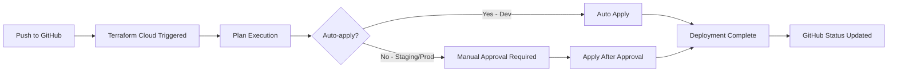

# VCS (GitHub) Integration Setup for Terraform Cloud

## Overview
This guide will help you set up VCS integration so that Terraform Cloud automatically runs plans and applies when you push to GitHub.

## Step 1: Connect GitHub to Terraform Cloud Organization

### 1.1 Add VCS Provider to Organization
1. Go to [Terraform Cloud Organization Settings](https://app.terraform.io/app/reddome/settings/version-control)
2. Click "Connect a VCS provider"
3. Select "GitHub" 
4. Choose "GitHub.com" (not GitHub Enterprise)
5. Follow the OAuth flow to authorize Terraform Cloud access to your GitHub account

### 1.2 Grant Access to Repository
During the OAuth flow:
- Grant access to the `reddomeuk` organization
- Ensure `redscan-platform` repository is accessible

## Step 2: Configure Each Workspace for VCS

### 2.1 Development Workspace
1. Go to: https://app.terraform.io/app/reddome/workspaces/redscan-development
2. Click "Settings" → "Version Control"
3. Click "Connect to version control"
4. Select your GitHub connection
5. Choose repository: `reddomeuk/redscan-platform`
6. Set configuration:
   - **Working Directory**: `terraform/`
   - **VCS branch**: Leave empty (triggers on all branches)
   - **Include submodules**: No
7. Click "Connect workspace"

### 2.2 Staging Workspace  
1. Go to: https://app.terraform.io/app/reddome/workspaces/redscan-staging
2. Follow same steps as development but set:
   - **VCS branch**: `staging`
   - **Working Directory**: `terraform/`
3. This will only trigger on pushes to the staging branch

### 2.3 Production Workspace
1. Go to: https://app.terraform.io/app/reddome/workspaces/redscan-production  
2. Follow same steps but set:
   - **VCS branch**: `main`
   - **Working Directory**: `terraform/`
3. This will only trigger on pushes to the main branch

## Step 3: Configure Trigger Patterns (Advanced)

### 3.1 Path-based Triggers
To only trigger when Terraform files change, you can set:
- **Trigger prefixes**: `terraform/`
- This ensures changes to other parts of the repo don't trigger deployments

### 3.2 GitHub Status Checks
Terraform Cloud will automatically:
- Post plan results as PR status checks
- Add plan summaries as PR comments
- Show apply status in GitHub

## Step 4: Workflow Configuration

### 4.1 Branch Protection Rules (Recommended)
Set up branch protection in GitHub:

```bash
# For main branch (production)
- Require pull request reviews
- Require status checks to pass (including Terraform plan)
- Require branches to be up to date
- Restrict pushes to main branch

# For staging branch
- Require status checks to pass
- Allow direct pushes for testing
```

### 4.2 Auto-Apply Settings
- **Development**: Auto-apply enabled (faster iteration)
- **Staging**: Manual approval required
- **Production**: Manual approval required + notifications

## Step 5: Test the Integration

### 5.1 Create a Test Branch
```bash
git checkout -b test-terraform-integration
```

### 5.2 Make a Small Change
```bash
# Edit a comment in terraform/main.tf
echo "# Test VCS integration" >> terraform/main.tf
git add terraform/main.tf
git commit -m "test: VCS integration"
git push origin test-terraform-integration
```

### 5.3 Create Pull Request
1. Create PR in GitHub
2. Terraform Cloud should automatically:
   - Run a plan
   - Post results as PR comment
   - Show status check

### 5.4 Merge to Trigger Apply
- Development: Auto-applies immediately
- Staging/Production: Requires manual approval in Terraform Cloud

## Step 6: Monitoring and Notifications

### 6.1 Slack Integration (Optional)
1. Go to Organization Settings → Integrations
2. Add Slack integration
3. Configure notifications for:
   - Plan completion
   - Apply success/failure
   - Policy violations

### 6.2 Email Notifications
Configure in workspace settings:
- Plan failures
- Apply completions
- Policy check failures

## Workflow Summary



## Environment-Specific Triggers

| Environment | Branch | Auto-Apply | Trigger |
|-------------|--------|------------|---------|
| Development | Any branch | ✅ Yes | All pushes |
| Staging | `staging` | ❌ Manual | Staging branch only |
| Production | `main` | ❌ Manual | Main branch only |

## Best Practices

### 1. Branch Strategy
```bash
feature/new-feature → development (auto-deploy)
                  ↓
               staging (manual approval)
                  ↓  
                main (manual approval + review)
```

### 2. Commit Messages
Use conventional commits for better tracking:
```bash
feat(terraform): add new Azure resource
fix(terraform): correct resource group name
chore(terraform): update provider versions
```

### 3. Plan Review Process
- Always review plans in PRs before merging
- Check resource changes and costs
- Verify security implications
- Test in development first

## Troubleshooting

### Common Issues:
1. **VCS not triggering**: Check working directory path
2. **Plans failing**: Verify environment variables are set
3. **No GitHub status**: Ensure OAuth permissions are correct
4. **Branch not found**: Check branch name matches exactly

### Debug Steps:
1. Check workspace run history
2. Review run logs in Terraform Cloud
3. Verify GitHub webhook delivery
4. Check repository permissions

## Security Considerations

1. **Sensitive Variables**: Always mark secrets as sensitive
2. **Branch Protection**: Protect main/staging branches
3. **Access Control**: Limit who can approve applies
4. **Audit Logging**: Monitor all workspace access

## Next Steps After Setup

1. Test with a simple change to development
2. Create staging branch and test staging deployment
3. Set up production deployment approval process
4. Configure monitoring and alerting
5. Document team workflow procedures